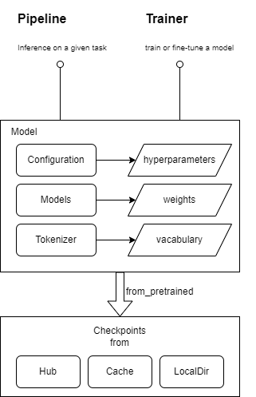

##### 旨在进行大模型工程优化学习，不简单基于huggingface transformers包实现，而是复制huggingface transformers工作流和主流大模型架构抽象API，删除了现有工程优化代码，通过学习将其集成到禹智项目中，并对代码结构进行优化。
__主要关注的工程化方向：__
1. 模型压缩，通过量化、减少参数量等方法减少模型内存/显存占用量，用更小成本运行性能相近的模型
2. 推理增强，通过添加一些启发式搜索算法，如：Beam Search等...方法提升推理性能
3. 性能和扩展性优化，分布式训练和推理，集成DeepSpeed、flash_attn等三方包
4. 增加常用模型架构抽象API，如BERT、GPT、T5等...
5. 增加常用task head，如分类、序列标注、文本生成等...

__tranformers核心抽象：__  

__禹智项目架构：__  

__transformers工作流：__  

